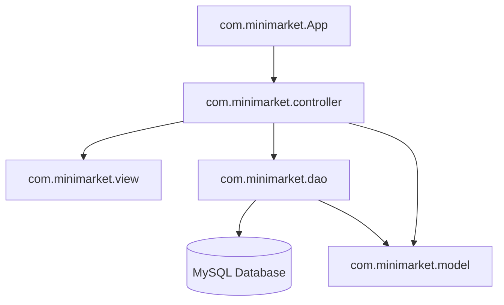
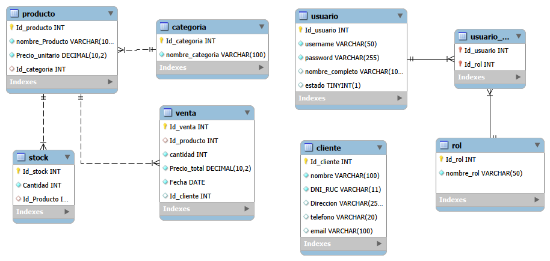

# 🛒 Sistema de Gestión MiniMarket (MiniMarket Management System)

¡Bienvenido al **Sistema de Gestión para MiniMarket**! Esta es una aplicación de escritorio robusta desarrollada en **Java 21** utilizando la arquitectura **MVC (Modelo-Vista-Controlador)** y una base de datos **MySQL**. Está diseñada para optimizar los procesos diarios de un minimarket, incluyendo control de inventario, ventas, gestión de clientes, categorías y reportes analíticos con exportación a Excel.

---

## 🚀 Tecnologías y Herramientas

El proyecto está construido bajo estándares profesionales y utiliza las siguientes herramientas:

*   **Lenguaje:** Java 21 (LTS)
*   **Interfaz Gráfica:** Java Swing (con Look and Feel del sistema nativo)
*   **Gestor de Dependencias:** Maven
*   **Base de Datos:** MySQL 8.0+
*   **Pruebas Unitarias e Integración:** JUnit 5 & Mockito 5
*   **Análisis Estático de Código:** SpotBugs
*   **Cobertura de Pruebas:** JaCoCo
*   **Librerías Clave:**
    *   `mysql-connector-java` para la conexión JDBC.
    *   `Apache POI` para la generación y exportación de reportes a hojas de cálculo de Excel (`.xlsx`).
    *   `Google Guava` para utilidades avanzadas.
    *   `Logback` para un sistema de logging estructurado.

---

## 🎨 Características Principales

1.  🔐 **Autenticación y Roles de Usuario:**
    *   Control de acceso seguro mediante inicio de sesión.
    *   Soporte para roles: **Administrador** (acceso completo) y **Vendedor** (acceso limitado a ventas).
    *   Cifrado de contraseñas mediante algoritmo seguro **SHA-256**.
    *   Modo offline automático en caso de pérdida de conexión con la base de datos (inicia en modo demostración/lectura).
2.  📊 **Panel de Control (Dashboard):**
    *   Visualización consolidada del estado del negocio.
    *   Métricas rápidas e indicador de stock bajo.
3.  📦 **Gestión de Inventario (Stock):**
    *   Control de existencias de productos en tiempo real.
    *   Alertas de desabastecimiento e integración con códigos de barras (EAN-13).
4.  🛍️ **Módulo de Ventas:**
    *   Registro rápido de ventas seleccionando cliente y productos.
    *   Cálculo automático de precios e importes totales.
    *   Validación de stock disponible antes de procesar la venta.
5.  🏷️ **Gestión de Categorías:**
    *   Clasificación lógica de productos (Abarrotes, Bebidas, Lácteos, Cuidado Personal, etc.) para facilitar la búsqueda.
6.  📈 **Reportes y Exportación:**
    *   Generación de estadísticas detalladas de ventas e inventario.
    *   Exportación directa a Microsoft Excel utilizando la potencia de `Apache POI`.

---

## 📐 Arquitectura del Proyecto

El sistema sigue estrictamente el patrón de diseño **MVC** (Modelo-Vista-Controlador) acoplado con **DAO** (Data Access Object) para la capa de persistencia:



### Estructura de Paquetes

*   [`com.minimarket`](file:///src/main/java/com/minimarket/): Contiene la clase de arranque de la aplicación ([`App.java`](file:///src/main/java/com/minimarket/App.java)).
*   [`com.minimarket.config`](file:///src/main/java/com/minimarket/config/): Gestiona la configuración de conexión JDBC a través de un patrón Singleton ([`DatabaseConnection.java`](file:///src/main/java/com/minimarket/config/DatabaseConnection.java)).
*   [`com.minimarket.model`](file:///src/main/java/com/minimarket/model/): Define las entidades principales del dominio (`Producto`, `Categoria`, `Stock`, `Cliente`, `Venta`, `Usuario`, `Rol`).
*   [`com.minimarket.view`](file:///src/main/java/com/minimarket/view/): Interfaces gráficas construidas en Swing (ventanas principales, formularios de inserción y edición).
*   [`com.minimarket.controller`](file:///src/main/java/com/minimarket/controller/): Contiene los controladores que coordinan las vistas e interactúan con la capa de datos.
*   [`com.minimarket.dao`](file:///src/main/java/com/minimarket/dao/) / [`impl`](file:///src/main/java/com/minimarket/dao/impl/): Abstracción y consultas SQL directas a la base de datos (CRUDs).
*   [`com.minimarket.util`](file:///src/main/java/com/minimarket/util/): Clases de utilidad como encriptación, validaciones, etc.

---

## 🗄️ Estructura de la Base de Datos

La base de datos se denomina `minimarket_yuly` y cuenta con un diseño relacional optimizado para la consistencia referencial:

### Diagrama Entidad-Relación (DER)

El diseño físico de la base de datos se representa en el siguiente diagrama:



### Inicialización de Datos

El repositorio incluye dos scripts SQL listos para su uso en la raíz del proyecto:
1.  [`db_schema.sql`](file:///db_schema.sql): Crea la base de datos y define la estructura de todas las tablas con sus relaciones y claves foráneas.
2.  [`populate_data.sql`](file:///populate_data.sql): Inicializa la base de datos con datos reales de productos de consumo masivo en el mercado peruano (arroz, aceites, lácteos, bebidas con códigos EAN-13 reales), stock por defecto, roles y usuarios de prueba.

---

## ⚙️ Configuración y Despliegue

### Requisitos Previos
*   **Java JDK 21** o superior instalado.
*   **Maven 3.8+** instalado.
*   **MySQL Server 8.0+** en ejecución.

### Pasos para Configurar la Aplicación

1.  **Clonar el repositorio:**
    ```bash
    git clone https://github.com/zZKingWolfZz/minimarket.git
    cd minimarket
    ```

2.  **Configurar la Base de Datos:**
    *   Abre tu cliente de MySQL (MySQL Workbench, phpMyAdmin, DBeaver o terminal).
    *   Ejecuta el contenido del script [`db_schema.sql`](file:///db_schema.sql). Esto creará la base de datos `minimarket_yuly`, las tablas y los usuarios de prueba por defecto.

3.  **Ajustar credenciales de conexión:**
    *   Navega a [`src/main/resources/database.properties`](file:///src/main/resources/database.properties) y edita los valores correspondientes a tu servidor MySQL local:
    ```properties
    db.url=jdbc:mysql://localhost:3306/minimarket_yuly?useSSL=true&serverTimezone=UTC&allowPublicKeyRetrieval=true&createDatabaseIfNotExist=true
    db.username=tu_usuario
    db.password=tu_contraseña
    db.driver=com.mysql.cj.jdbc.Driver
    # Habilitar inicio automático (opcional, salta el login para pruebas rápidas)
    db.autologin=false
    ```

---

## 🔨 Instrucciones de Ejecución y Compilación

El proyecto está completamente preparado para compilarse, ejecutarse o empaquetarse en un ejecutable de Windows (`.exe`) nativo a través de Maven:

### Compilar el proyecto
```bash
mvn clean compile
```

### Ejecutar la aplicación desde la consola
```bash
mvn exec:java
```

### Generar el archivo ejecutable (`.exe`) para Windows
El proyecto cuenta con la integración automática de `launch4j-maven-plugin`. Para generar un archivo `.exe` autocontenido con todas sus dependencias incluidas (Fat JAR), ejecuta:
```bash
mvn clean package -DskipTests
```
Una vez terminado el proceso, encontrarás el ejecutable listo para usar en:
*   📂 `target/MiniMarket.exe`

*(Nota: Requiere que Windows tenga una versión de Java runtime compatible con JDK 21+ configurada, o que se proporcione en el path).*

---

## 🧪 Pruebas y Control de Calidad

El proyecto implementa un estricto control de calidad mediante pruebas automatizadas y análisis estático.

### Ejecutar Pruebas Unitarias e de Integración
Las pruebas utilizan **JUnit 5** y **Mockito** para simular la interacción con la base de datos y la GUI de forma aislada.
```bash
mvn test
```

### Cobertura de Código (JaCoCo)
Cada vez que se ejecutan los tests, **JaCoCo** genera un informe de cobertura. Puedes visualizarlo abriendo el siguiente archivo en tu navegador una vez completada la prueba:
`target/site/jacoco/index.html`

### Análisis Estático (SpotBugs)
Para buscar vulnerabilidades, malas prácticas o bugs potenciales en el código, ejecuta:
```bash
mvn spotbugs:check
```
Si deseas ver la interfaz gráfica interactiva de SpotBugs para navegar detalladamente entre los hallazgos:
```bash
mvn spotbugs:gui
```

---

## 👥 Credenciales de Prueba por Defecto

Una vez que ejecutes la aplicación, podrás iniciar sesión con los siguientes usuarios cargados por defecto:

| Rol | Usuario | Contraseña |
| :--- | :--- | :--- |
| **Administrador** | `admin` | `admin` |
| **Vendedor** | `vendedor` | `vendedor` |
