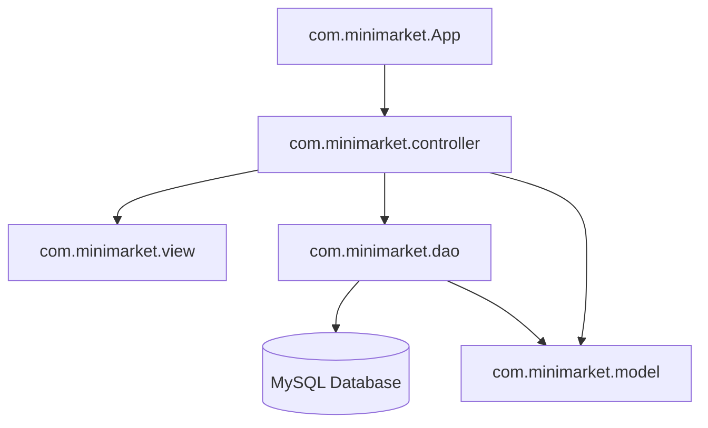

# 🛒 Sistema de Gestión MiniMarket (MiniMarket Management System)

¡Bienvenido al **Sistema de Gestión para MiniMarket**! Esta es una aplicación de escritorio robusta desarrollada en **Java 21** utilizando la arquitectura **MVC (Modelo-Vista-Controlador)** y una base de datos **MySQL**. Está diseñada para optimizar los procesos diarios de un minimarket, incluyendo control de inventario, ventas, gestión de clientes, categorías y reportes analíticos con exportación a Excel.

---

## 🚀 Tecnologías y Herramientas

El proyecto está construido bajo estándares profesionales y utiliza las siguientes herramientas:

*   **Lenguaje:** Java 21 (LTS)
*   **Interfaz Gráfica:** Java Swing (con Look and Feel del sistema nativo)
*   **Gestor de Dependencias:** Maven
*   **Base de Datos:** MySQL 8.0+
*   **Pruebas Unitarias e Integración:** JUnit 5 & Mockito 5
*   **Análisis Estático de Código:** SpotBugs
*   **Cobertura de Pruebas:** JaCoCo
*   **Librerías Clave:**
    *   `mysql-connector-java` para la conexión JDBC.
    *   `Apache POI` para la generación y exportación de reportes a hojas de cálculo de Excel (`.xlsx`).
    *   `Google Guava` para utilidades avanzadas.
    *   `Logback` para un sistema de logging estructurado.
*   **Empaquetador de Instalador:** Inno Setup 6

---

## 🎨 Características Principales

1.  🔧 **Instalación y Configuración de BD Dinámica:**
    *   **Sin Base de Datos Fija:** La aplicación no depende de un archivo estático de configuración ni requiere que configures manualmente las tablas en MySQL Workbench antes de iniciar.
    *   **Asistente de Conexión:** Si es el primer arranque o la conexión con la base de datos falla, se iniciará de forma automática un **Asistente de Configuración de Base de Datos** premium donde podrás ingresar la IP, el Puerto, el Nombre de la BD, el Usuario y la Contraseña.
    *   **Auto-Creación de Esquema**: Tras conectarse con éxito, el sistema crea la base de datos si no existe e inicializa todo el esquema de tablas y categorías iniciales automáticamente.
2.  🔐 **Autenticación y Roles de Usuario:**
    *   Control de acceso seguro mediante inicio de sesión.
    *   Soporte para roles: **Administrador** (acceso completo) y **Vendedor** (acceso limitado a ventas).
    *   Cifrado de contraseñas mediante algoritmo seguro **SHA-256**.
    *   **Registro del Administrador Inicial (First-Run)**: Si la base de datos está vacía, el sistema arranca con un formulario estético de dos columnas para crear la cuenta de administrador principal.
3.  📊 **Panel de Control (Dashboard):**
    *   Visualización consolidada del estado del negocio.
    *   Métricas rápidas e indicador de stock bajo.
4.  👥 **Gestión de Usuarios Integrada:**
    *   Sección integrada de forma nativa en el panel del Dashboard (sin ventanas emergentes molestas).
    *   Permite registrar nuevos usuarios y ver la lista completa en tiempo real en una tabla interactiva ubicada en la parte inferior del panel.
5.  📦 **Gestión de Inventario (Stock):**
    *   Control de existencias de productos en tiempo real.
    *   Alertas de desabastecimiento e integración con códigos de barras (EAN-13).
6.  🛍️ **Módulo de Ventas:**
    *   Registro rápido de ventas seleccionando cliente y productos.
    *   Cálculo automático de precios e importes totales.
    *   Validación de stock disponible antes de procesar la venta.
7.  🏷️ **Gestión de Categorías:**
    *   Clasificación lógica de productos con categorías iniciales precargadas (*Abarrotes, Bebidas, Lácteos, Limpieza, Cuidado Personal, Snacks y Golosinas, Panadería*).
8.  📈 **Reportes y Exportación:**
    *   Generación de estadísticas detalladas de ventas e inventario.
    *   Exportación directa a Microsoft Excel utilizando la potencia de `Apache POI`.

---

## 📐 Arquitectura del Proyecto

El sistema sigue estrictamente el patrón de diseño **MVC** (Modelo-Vista-Controlador) acoplado con **DAO** (Data Access Object) para la capa de persistencia:



### Estructura de Paquetes

*   [`com.minimarket`](file:///src/main/java/com/minimarket/): Contiene la clase de arranque de la aplicación ([`App.java`](file:///src/main/java/com/minimarket/App.java)).
*   [`com.minimarket.config`](file:///src/main/java/com/minimarket/config/): Gestiona la configuración de conexión JDBC a través de un patrón Singleton ([`DatabaseConnection.java`](file:///src/main/java/com/minimarket/config/DatabaseConnection.java)).
*   [`com.minimarket.model`](file:///src/main/java/com/minimarket/model/): Define las entidades principales del dominio (`Producto`, `Categoria`, `Stock`, `Cliente`, `Venta`, `Usuario`, `Rol`).
*   [`com.minimarket.view`](file:///src/main/java/com/minimarket/view/): Interfaces gráficas construidas en Swing (ventanas principales, formularios de inserción y edición). Contiene componentes premium con bordes redondeados y soporte para placeholders.
*   [`com.minimarket.controller`](file:///src/main/java/com/minimarket/controller/): Contiene los controladores que coordinan las vistas e interactúan con la capa de datos.
*   [`com.minimarket.dao`](file:///src/main/java/com/minimarket/dao/) / [`impl`](file:///src/main/java/com/minimarket/dao/impl/): Abstracción y consultas SQL directas a la base de datos (CRUDs).
*   [`com.minimarket.util`](file:///src/main/java/com/minimarket/util/): Clases de utilidad como el gestor de iconos del sistema ([`IconUtil.java`](file:///src/main/java/com/minimarket/util/IconUtil.java)) y utilidades criptográficas.

---

## 🗄️ Estructura de la Base de Datos

La base de datos se denomina `minimarket_yuly` y cuenta con un diseño relacional optimizado para la consistencia referencial.

### Inicialización de Datos

El repositorio incluye los siguientes archivos en la raíz del proyecto para referencias o copias de seguridad:
1.  [`db_schema.sql`](file:///db_schema.sql): Crea la base de datos y define la estructura de todas las tablas e incluye la inserción automática de los roles y categorías iniciales por defecto.
2.  [`minimarket_yuly_backup.sql`](file:///minimarket_yuly_backup.sql): Respaldo completo de la base de datos con registros reales y datos de prueba.

---

## ⚙️ Configuración y Despliegue

### Requisitos Previos
*   **Java JDK 21** o superior instalado.
*   **Maven 3.8+** instalado.
*   **MySQL Server 8.0+** en ejecución.

### Pasos para Configurar y Ejecutar la Aplicación

1.  **Clonar el repositorio:**
    ```bash
    git clone https://github.com/zZKingWolfZz/minimarket.git
    cd minimarket
    ```

2.  **Arrancar la aplicación:**
    *   No necesitas configurar archivos. Simplemente ejecuta el comando de arranque o el instalador generado.
    *   En el primer arranque, la aplicación abrirá la interfaz gráfica de configuración de base de datos.
    *   Introduce los datos de tu servidor MySQL local y haz clic en **Probar y Conectar**.
    *   El sistema guardará de forma local el archivo `database.properties` en el directorio raíz de la aplicación (este archivo está configurado en `.gitignore` para que tus contraseñas locales nunca se suban a GitHub).
    *   A continuación, si es la primera vez que se monta la base de datos, aparecerá la pantalla de **Registro del Administrador Inicial**.

---

## 🔨 Instrucciones de Ejecución y Compilación

### Compilar el proyecto
```bash
mvn clean compile
```

### Ejecutar la aplicación desde la consola
```bash
mvn exec:java
```

### Generar el archivo ejecutable (`.exe`) para Windows
El proyecto cuenta con la integración automática de `launch4j-maven-plugin`. Para generar un archivo `.exe` autocontenido con todas sus dependencias incluidas (Fat JAR) y el icono del logotipo oficial incrustado, ejecuta:
```bash
mvn clean package -DskipTests
```
Una vez terminado el proceso, encontrarás el ejecutable listo para usar en:
*   📂 `target/MiniMarket.exe`

### Compilar el Instalador de Windows (.exe)
El proyecto contiene el script de Inno Setup 6 `minimarket.iss`. Si tienes instalado Inno Setup Compiler (`ISCC.exe`), puedes compilar el instalador desde la terminal con:
```bash
ISCC minimarket.iss
```
Esto creará el instalador autoejecutable en:
*   📂 `target/MiniMarket_Setup.exe`

### 🚀 Lanzamientos y Versión Portable
Para obtener instrucciones detalladas sobre cómo compilar los ejecutables y publicarlos en la sección de **Releases** de GitHub, consulta la guía de lanzamientos:
*   📄 [RELEASES.md](file:///c:/Users/arnie/.gemini/antigravity-ide/scratch/minimarket-arquitectura-unificado/RELEASES.md)

---

## 🧪 Pruebas y Control de Calidad

### Ejecutar Pruebas Unitarias e de Integración
Las pruebas utilizan **JUnit 5** y **Mockito** para simular la interacción con la base de datos y la GUI de forma aislada.
```bash
mvn test
```

### Cobertura de Código (JaCoCo)
Cada vez que se ejecutan los tests, **JaCoCo** genera un informe de cobertura. Puedes visualizarlo abriendo el siguiente archivo en tu navegador una vez completada la prueba:
`target/site/jacoco/index.html`

### Análisis Estático (SpotBugs)
Para buscar vulnerabilidades o malas prácticas, ejecuta:
```bash
mvn spotbugs:check
```
